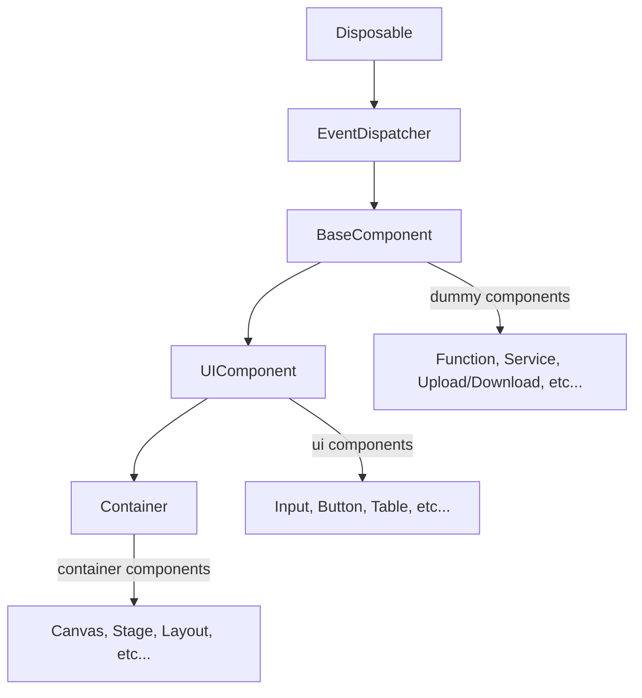

# Nexure No-Code Platform Refactor

## Challenge

When I joined, the platform has released it's alpha version, however, this version filled with tons of bugs, so my task was sorting out the project logic, fixing bugs, adding features and releaing a stable version.

After analysing the codes and requirements docs, I found there were several problems:

1. Codes had been deeply coupled and the readability was low, fixing a bug could take a long time to locating the source code of the issue.
2. Memory were not properly managed, and when the data volume becomes large, the system becomes slow
3. There were redundancy in serialized data and it was difficult to manage them.
4. Lacking an effective way to connect async data between no-code components.

### Building a no-code component was difficult and obscure to integrate with the property relationship system

```js
<template>
  <q-toggle
    :class="css.value"
    v-model="value.value"
    :label="!!value.value ? activeText.value : inactiveText.value"
    @update:model-value="handleChange"
  />
</template>

<script setup lang="ts">
import { defineProps, toRef, inject } from 'vue'
import { IComponentsElement } from 'types/frontend'
import Manager from './Execution/Manager'
import { ExperienceEventNameEnum } from '../../Enum'
import { JsonValue } from '../../common/types/JsonType'

type Props = {
  data: IComponentsElement
  nestedId?: string
  isTable?: boolean
}

// Obsecure vue props
const props = defineProps<Props>()
const data = toRef(props, 'data')
const manager = inject<Manager>('runtimeManager')


const id = manager._initComponentData(data, props.nestedId, props.isTable)

// every component property, value, activeText, inactiveText, css, are required to obtain from an obscure manager instance
const value = manager.getComponentKey({
  key: 'value',
  id,
  defaultValue: data.value.properties['value'].value as JsonValue,
})

const activeText = manager.getComponentKey({
  key: 'activeText',
  id,
  defaultValue: data.value.properties['activeText'].value as JsonValue,
}) as { value: string }

const inactiveText = manager.getComponentKey({
  key: 'inactiveText',
  id,
  defaultValue: data.value.properties['inactiveText'].value as JsonValue,
}) as { value: string }

const css = manager.getComponentKey({
  key: 'css',
  id,
  defaultValue: data.value.properties['css'].value as JsonValue,
})

const handleChange = () => {
  // Obsecure component event handling
  manager.handleEvent(ExperienceEventNameEnum.toggled, { 
    id,
    isTable: props.isTable,
    tableId: props.nestedId,
  })
}
</script>

```

## Solution

My solution was abstracting the no-code components, including relevant methods, events and properties into an independent package called nexure-engine, the package was framework agnostic and di-based.

The structure of the nexure-engine looks like following:

### nexure-engine structure



### Disposable pattern

I introduced the Disposable pattern to help managing the all disposable objects

```ts

/**
 * Manages a collection of disposable values.
 *
 * This is the preferred way to manage multiple disposables. A `DisposableStore` is safer to work with than an
 * `IDisposable[]` as it considers edge cases, such as registering the same value multiple times or adding an item to a
 * store that has already been disposed of.
 */
export class DisposableStore implements IDisposable {
  static DISABLE_DISPOSED_WARNING = false;

  private readonly _toDispose = new Set<IDisposable>();
  private _isDisposed = false;

  constructor() {
    trackDisposable(this);
  }

  /**
   * Dispose of all registered disposables and mark this object as disposed.
   *
   * Any future disposables added to this object will be disposed of on `add`.
   */
  public dispose(): void {
    if (this._isDisposed) {
      return;
    }

    markAsDisposed(this);
    this._isDisposed = true;
    this.clear();
  }

  /**
   * @return `true` if this object has been disposed of.
   */
  public get isDisposed(): boolean {
    return this._isDisposed;
  }

  /**
   * Dispose of all registered disposables but do not mark this object as disposed.
   */
  public clear(): void {
    if (this._toDispose.size === 0) {
      return;
    }

    try {
      dispose(this._toDispose);
    } finally {
      this._toDispose.clear();
    }
  }

  /**
   * Add a new {@link IDisposable disposable} to the collection.
   */
  public add<T extends IDisposable>(o: T): T {
    if (!o) {
      return o;
    }
    if ((o as unknown as DisposableStore) === this) {
      throw new Error('Cannot register a disposable on itself!');
    }

    setParentOfDisposable(o, this);
    if (this._isDisposed) {
      if (!DisposableStore.DISABLE_DISPOSED_WARNING) {
        console.warn(new Error('Trying to add a disposable to a DisposableStore that has already been disposed of. The added object will be leaked!').stack);
      }
    } else {
      this._toDispose.add(o);
    }

    return o;
  }
}

/**
 * Abstract base class for a {@link IDisposable disposable} object.
 *
 * Subclasses can {@linkcode _register} disposables that will be automatically cleaned up when this object is disposed of.
 */
export abstract class Disposable implements IDisposable {
  static readonly None = Object.freeze<IDisposable>({ dispose() {} });

  protected readonly _store = new DisposableStore();

  constructor() {
    trackDisposable(this);
    setParentOfDisposable(this._store, this);
  }

  public dispose(): void {
    markAsDisposed(this);

    this._store.dispose();
  }

  /**
   * Adds `o` to the collection of disposables managed by this object.
   */
  protected _register<T extends IDisposable>(o: T): T {
    if ((o as unknown as Disposable) === this) {
      throw new Error('Cannot register a disposable on itself!');
    }
    return this._store.add(o);
  }
}

export class DisposableMap<K, V extends IDisposable = IDisposable> extends Map<K, V> implements IDisposable {
  protected _isDisposed = false;

  constructor() {
    super();
    trackDisposable(this);
  }

  /**
   * Disposes of all stored values and mark this object as disposed.
   *
   * Trying to use this object after it has been disposed of is an error.
   */
  dispose(): void {
    markAsDisposed(this);
    this._isDisposed = true;
    this.clearAndDisposeAll();
  }

  /**
   * Disposes of all stored values and clear the map, but DO NOT mark this object as disposed.
   */
  clearAndDisposeAll(): void {
    if (!this.size) {
      return;
    }

    try {
      dispose(this.values());
    } finally {
      this.clear();
    }
  }

  public override set(key: K, value: V, skipDisposeOnOverwrite = false) {
    if (this._isDisposed) {
      console.warn(new Error('Trying to add a disposable to a DisposableMap that has already been disposed of. The added object will be leaked!').stack);
    }

    if (!skipDisposeOnOverwrite) {
      this.get(key)?.dispose();
    }

    super.set(key, value);

    return this;
  }

  /**
   * Delete the value stored for `key` from this map and also dispose of it.
   */
  deleteAndDispose(key: K): void {
    this.get(key)?.dispose();
    this.delete(key);
  }
}

export class DisposableSet<V extends IDisposable> extends Set<V> implements IDisposable { ... }

export class DisposableArray<T extends IDisposable = IDisposable> extends Array<T> { ... }
```

### Serialization Service

I introduced a serialization service to handle the data serialization

```ts
// SerializeService.ts

...
const serializers = new Map<new (...args: any[]) => ISerializer, { name: string; serializer: ClassSerializer }>();
const serializerInversed = new Map<string, ClassSerializer>();

const jsTypes = new Map();

// Setting a corresponding serializer for each fundamental object by default
jsTypes.set(Object, new PlainObjectSerializer());
jsTypes.set(Array, new ArraySerializer(Array));
jsTypes.set(Map, new MapObjectSerializer(Map));
jsTypes.set(Set, new SetObjectSerializer(Set));
jsTypes.set(DisposableSet, new SetObjectSerializer(DisposableSet));
jsTypes.set(ObservableSet, new SetObjectSerializer(ObservableSet));
jsTypes.set(Date, new DateObjectSerializer());
jsTypes.set(RegExp, new RegExpObjectSerializer());
jsTypes.set(DisposableMap, new MapObjectSerializer(DisposableMap));
jsTypes.set(ObservableMap, new MapObjectSerializer(ObservableMap));
jsTypes.set(DisposableArray, new ArraySerializer(DisposableArray));
jsTypes.set(null, new NullPrototypeObjectSerializer());

{
  for (const [ctor, serializer] of jsTypes) {
    serializers.set(ctor, {
      name: ctor === null ? null : ctor.name,
      serializer,
    });
  }
}

{
  for (const { name, serializer } of serializers.values()) {
    serializerInversed.set(name, serializer);
  }
}

const NOT_SERIALIZABLE = {};

export interface ClassSerializerCtor {
  new (...args: any[]): ISerializer;
  deserialize?(ctx: IDecodeContext, Ctor?: ClassSerializerCtor): void;
}

export class ClassSerializer {
  constructor(
    readonly Constructor: ClassSerializerCtor,
    @IInstantiationService private readonly instantiationService: IInstantiationService,
    @IComponentService readonly componentService: IComponentService
  ) {}

  serialize(serialier: ISerializer, ctx: IEncodeContext) {
    serialier.serialize(ctx);
  }

  deserialize(context: IDecodeContext) {
    if (typeof this.Constructor.deserialize === 'function') {
      return this.Constructor.deserialize(context, this.Constructor);
    }
    const obj = context.createInstance(this.Constructor);
    obj.deserialize(context);
    return obj;
  }
}

/**
 * Decode serialized json data to instance 
 */
class DecodeContext implements IDecodeContext {
  constructor(
    private readonly data: SerializedData,
    readonly extend: object = {},
    @IInstantiationService readonly instantiationService: IInstantiationService,
    @IComponentService readonly componentService: IComponentService,
    @IPropertyService readonly propertyService: IPropertyService,
    @ISerializeService readonly serializeService: ISerializeService
  ) {}

  /**
   * Creating instance by injecting the decode context itself
   */
  createInstance<Ctor extends ClassSerializerCtor, R extends InstanceType<Ctor>>(ctor: Ctor, ...args: GetLeadingNonServiceArgs<ConstructorParameters<Ctor>>): R {
    return this.instantiationService
      .createChild(
        new ServiceCollection([
          IDecodeContextService,
          {
            context: this,
          },
        ])
      )
      .createInstance(ctor, ...args);
  }

  /**
   * Read the decoded object
   * @param name name of the object, which is mapped on JSON
   * @param extend Extensive data that needs to be recursively passed to next level of decode context
   */
  read = (name?: string, extend?: any) => {
      // ...
          const [deserializerType, value] = item;

          // Get deserializer by deserializerType (it usually indicates the object constructor's name)
          const deserializer = this.serializeService.getDeserializerFor(deserializerType);

          // Injecting the json data by creating a DecodeContext
          const decoder = this.instantiationService.createInstance(DecodeContext, value, { ...this.extend, ...extend });

          return deserializer.deserialize(decoder);
      //...
  };
}


/**
 * Encode js instance to serialized json data
 */
export class EncodeContext implements IEncodeContext {
  parentContext: SerializedData | null = null;

  constructor(
    private readonly context: SerializedData,
    private readonly id: string | undefined,
    @ISerializeService readonly serializeService: ISerializeService,
    @IInstantiationService readonly instantiationService: IInstantiationService
  ) {}

  static serializeLazy(lazy: Function, serialize: (data: any) => void) {
    // ...
  }

  /**
   * Create serialized data on the object
   */
  private attemptDefineProperty(context: SerializedData, key: string, value: any) {
    //...
  }

  private process(item: any, key?: string) {
    if (item === undefined) {
      return;
    }

    if (typeof item === 'object' && item !== null) {

      // Get the serializer of the object
      const { serializer, name: serializerName } = this.serializeService.getSerializerFor(item);

      // Serialize the object into a json value by the serializer
      serializer.serialize(item, key ? this.create(serializerName, key) : this);
    } else if (typeof item === 'function') {

      // In some scenarios, a function can also be serialized
      EncodeContext.serializeLazy(item, (data) => this.process(key, data));
    } else if (key) {

      // Serialize other primative data
      this.attemptDefineProperty(this.context, key, item);
    } else if (this.parentContext && this.id !== undefined) {
      this.attemptDefineProperty(this.parentContext, this.id, item);
    } else {
      throw new Error(`serialize failed: ${item}`);
    }
  }

  write = (item: any, key?: string) => {
    this.process(item, key);
  };

  /**
   * Create a EncodeContext by injecting a shared object
   */
  create(serializerName: string, name: string) {
    const nextCtx = Object.create(null);
    Object.defineProperty(this.context, name, {
      value: [serializerName, nextCtx],
      writable: false,
      configurable: false,
      enumerable: true,
    });
    const child = this.instantiationService.createInstance(EncodeContext, nextCtx, name);
    child.parentContext = this.context;
    return child;
  }
}

/**
 * SerializeService needs to be injected at first
 */
export class SerializeService {
  declare readonly _serviceBrand: undefined;

  serializers = new Map(serializers);
  serializerInversed = new Map(serializerInversed);

  constructor(@IComponentService readonly componentService: IComponentService, @IInstantiationService readonly instantiationService: IInstantiationService) {
    this.initialize();
  }

  private initialize() {
    //...
  }

  createSerializedData(serializer: ISerializer) {
    //...
  }

  getSerializerFor(object: any) {
    //...
  }

  getDeserializerFor(type: string) {
    //...
  }

  async deserializeCanvas(data: SerializedData, extend?: any) {
    //...
  }

  deserializeData(deserializer: Pick<ISerializer, 'deserialize'>, data: SerializedData, extend: object = {}, skipDrain: boolean = false) {
    //...
  }
}
```

For example, the serializer for RegExp is like:

```ts
// RegExpObjectSerializer.ts
import { IDecodeContext, IEncodeContext } from './types';

export class RegExpObjectSerializer {
  serialize(obj: any, context: IEncodeContext) {
    context.write(obj.source, 'source');
    context.write(obj.flags, 'flags');
  }

  deserialize(context: IDecodeContext) {
    return new RegExp(context.read('source'), context.read('flags'));
  }
}
```

Then a method for marking a custom class as a serializer is necessary

```ts
// makeSerialization.ts
import { ISerializer } from './types';

export const initialSerializers = new Map<string, new (...args: any[]) => ISerializer>();

// mark a constructor as serializer
export const markAsSerializer = <Ctor extends new (...args: any[]) => ISerializer>(Constructor: Ctor, name: string = Constructor.name) => {
  if (initialSerializers.has(name)) {
    console.log(`Serializer ${name} already exists, existing constructor will be used.`);
    return;
  }
  initialSerializers.set(name, Constructor);
};


/**
 * Component decorator
 */
export function Component(options?: {
  name?: string;
  deserialize?: (ctx: IDecodeContext) => ISerializer;
}) {
  return <T extends new (...args: any[]) => ISerializer>(ctor: T) => {
    // Every component should be serializable
    markAsSerializer(ctor, options?.name || ctor.name);

    if (options?.deserialize) {
      ctor.deserialize = (ctx: IDecodeContext) => {
        ctx.read('properties');
        return options.deserialize!(ctx);
      };
    }

    const originalDeserialize = ctor.prototype.deserialize;
    ctor.prototype.deserialize = function (this: { __de: Set<string>; [x: string]: any }, ...args: [IDecodeContext, ...any]) {
      this.__de.forEach((key) => this[key]);
      originalDeserialize.apply(this, args);
    };

    const originalSerialize = ctor.prototype.serialize;
    ctor.prototype.serialize = function (this: { __se: Map<string, string>; [x: string]: any }, ...args: [IEncodeContext, ...any]) {
      this.__se.forEach((privateKey, key) => {
        args[0].write(this[privateKey], key);
      });
      originalSerialize.apply(this, args);
    };


    return ctor;
  };
}

/**
 * An example of creating a custom component model
 */
@Component()
export class Button extends UIComponent {
  override events = [EventType.Click] as const;

  // property can be serialized by serialize decorator or implementing ISerializer functions
  // @serialize(() => "default", "buttonType")
  buttonType: 'default' | 'submit' | 'reset' = 'default';

  override serialize(ctx: IEncodeContext): void {
    ctx.write(this.buttonType, 'buttonType');
    super.serialize(ctx);
  }
  override deserialize(ctx: IDecodeContext): void {
    this.buttonType = ctx.read('buttonType');
    super.deserialize(ctx);
  }
}

```

### Bind property value with vue

Although the engine itself has been seperated from the platform, the properties should be binded with html renderer, as our project uses Vue3, it's easy to make a decorator to bind variables from engine to vue3 component.

```ts
import { Ref, ref, toRaw } from 'vue';

/**
 * Support two-way data binding for vue3
 * @param unwrap In some cases, the binding target can be a proxy object, and this can cause conflict with the ref of vue3, using unwrap to sanitize the object
 */
export function bind(unwrap?: (target:any) => any) {
  const map = new WeakMap<Object, Ref>();

  const getOrCreateRef = (target: any) => {
    let reference = map.get(target);

    if (!reference) {
      reference = ref();
      map.set(target, reference);
    }
    return reference;
  };

  return function (target: Object, propKey: string) {
    const getter = function (this: any) {
      const reference = getOrCreateRef(unwrap?.(this) ?? this);
      return reference.value;
    };
    const setter = function (this: any, value: any) {
      const reference = getOrCreateRef(unwrap?.(this) ?? this);
      reference.value = value;
    };

    Object.defineProperty(target, propKey, {
      get: getter,
      set: setter,
      enumerable: true,
      configurable: true,
    });
  };
}


@Component()
export class Button extends UIComponent {
  // Then in the component, using 'bind' to bind property to vue
  @bind()
  label = "Submit"
}
```

Finally, the view component becomes to

```vue3
<template>
  <q-btn :label="data.label" @click="onButtonClick" />
</template>
<script lang="ts" setup>
import { ref } from 'vue'
import { EventType } from '@nst/nexsure-engine/lib/EventType'
import { Button } from '@nst/nexsure-engine'

type Props = {
  model: Button
}
const props = defineProps<Props>()

const onButtonClick = () => {
  // dispatch event
  props.model.dispatch(EventType.Click)
}
</script>
```


[back](../)
