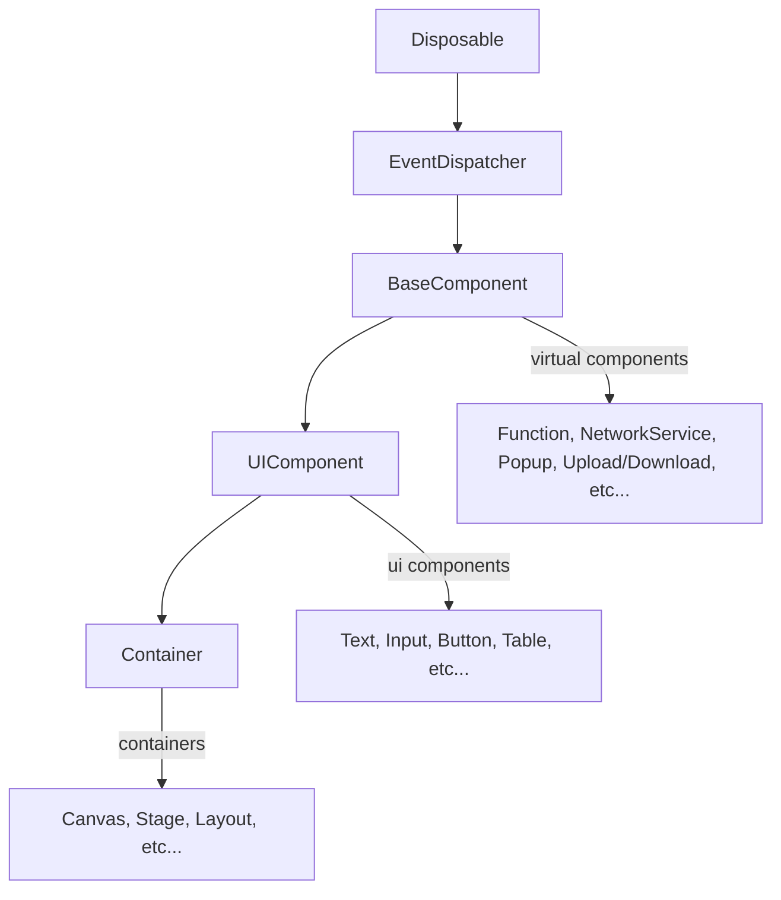

# Refactoring Nexus: A Scalable and Modular Low-Code Platform

## Overview

Nexus is a low-code platform that enables users to build web applications. When I joined the team, it had already released an alpha version, but it was plagued with numerous bugs, and the code was highly coupled, making bug fixes time-consuming due to the difficulty of tracing errors. After thorough discussions with the team, we decided to refactor the project. The core logic was abstracted into an independent engine, while Vue was solely responsible for rendering the UI.

## Challenges

1. **Resource management issues** - Memory leaks and unmanaged resources were common, especially when multiple low-code editing tabs were open.
2. **Serialization complexity** - The data serialization mechanism was inefficient and obscure.
3. **Scalability concerns** - The tightly coupled architecture hindered the ability to extend the platform easily.

## Solutions and Refactoring Process

### 1. **Decoupling with DI**

To make the platform more modular and maintainable, and to better manage data states across multiple low-code workspaces, I introduced the Dependency Injection (DI) pattern.

```typescript
class CodeMain {
  // ...
  /**
   * Creates or retrieves a low-code workspace. 
   * Each workspace has its own set of services, ensuring data isolation between workspaces.
   * 
   * @param name - Unique name of the workspace.
   * @param label - Optional UI label for the workspace.
   * @returns
   */
  createOrGetWorkSpace(name: string, label?: string) {
    // Check if the workspace already exists
    for (const stage of this.collection) {
      if (stage.name === name) {
        return stage;
      }
    }
    // Initialize services for the container
    const services = new ServiceCollection();
    services.set(ISerializeService, new SyncDescriptor(SerializeService));
    services.set(IComponentService, new SyncDescriptor(ComponentService, [this]));
    services.set(IPropertyService, new SyncDescriptor(PropertyService));

    const instantiation = new InstantiationService(services, true);

    return instantiation.invokeFunction((accessor) => {
      const componentService = accessor.get(IComponentService);

      const workspace = instantiation.createInstance(Stage) as Stage;
      workspace.name = name;
      if (label !== undefined) {
        workspace.label = label;
      }
      componentService.stage = workspace;

      this.collection.add(workspace);

      return workspace;
    });
  }
}
```

### 2. **Introducing the Disposable Pattern for Resource Management**

Unreleased resources, particularly memory leaks caused by lingering references, were a major issue. I implemented the **disposable pattern** to ensure that each component properly releases resources when no longer needed, improving overall performance.

**Example Implementation:**

```typescript
export interface IDisposable {
  dispose(): void;
}

export abstract class Disposable implements IDisposable {
  static readonly None = Object.freeze<IDisposable>({ dispose() {} });

  protected readonly _store = new DisposableStore();

  public dispose(): void {
    markAsDisposed(this);

    this._store.dispose();
  }

  protected _register<T extends IDisposable>(o: T): T {
    if ((o as unknown as Disposable) === this) {
      throw new Error("Cannot register a disposable on itself!");
    }
    return this._store.add(o);
  }
}
export function toDisposable(fn: () => void): IDisposable {
  const self = trackDisposable({
    dispose: once(() => {
      markAsDisposed(self);
      fn();
    }),
  });
  return self;
}

class IntervalExample extends Disposable {
  constructor() {
    super();
    const interval = setInterval(() => console.log("Running"), 1000);
    this._register(toDisposable(() => clearInterval(interval)));
  }
}

const component = new IntervalExample();
setTimeout(() => component.dispose(), 5000); // Cleans up after 5s
```

### 3. **Optimizing Serialization with a Dedicated Service**

The original serialization logic was fragmented and inefficient, often resulting in data corruption. To address this, I developed a **serialization service** that streamlined object serialization, enhanced code readability, and improved usability.

**Example:**

```typescript
/**
 * Marks the class as serializable.
 *
 * @param deserialize (Optional) A hook function that is triggered before deserialization. 
 *                    This can be used to execute specific actions or validate data.
 */
@Serializable({
  deserialize(ctx: IDecodeContext) {
    const keys = ctx.read("keys");

    ctx.queue(() => otherAction(keys)); // Actions that need to be executed before the deserialization.

    const service = ctx.createInstance(Service);
    service.deserialize(ctx);
    return service;
  },
})
export class Service implements ISerializer {

  /**
   * Built-in types (e.g., Map, Date, RegExp, Array, Set, etc.) can be serialized 
   * using their corresponding serializers, which have been developed internally.
   */
  map = new Map();
  keys = [1, 2, 3];

  constructor(
    @ISerializeService override readonly serializeService: ISerializeService,
    @IInstantiationService override readonly instantiationService: IInstantiationService
  ) {}

  /**
   * Target can be serialized in implemented functions or through a decorator.
   *
   * @param defaultValue The default value of the target (optional).
   */
  @serialize(false)
  disconnected!: Boolean;

  deserialize(ctx: IDecodeContext) {
    this.keys = ctx.read("keys");
    this.map = ctx.read("map");
  }

  serialize(ctx: IEncodeContext) {
    ctx.write(this.keys, "keys");
    ctx.write(this.map, "map");
  }
}
```

### 4. **Vue 3 Two-Way Data Binding with `@bind` Decorator**

Binding engine variables to framework component props is necessary for seamless data synchronization. Since our frontend framework is `Vue 3`, we can easily implement this using **ref** and **toRaw**.

**Implementation:**

```typescript
export function bind() {
  const map = new WeakMap<Object, Ref>();

  const getOrCreateRef = (target: any) => {
    let reference = map.get(target);

    if (!reference) {
      reference = ref();
      map.set(target, reference);
    }
    return reference;
  };

  return function (target: Object, propKey: string) {
    const getter = function (this: any) {
      const reference = getOrCreateRef(unwrap(this));
      return reference.value;
    };
    const setter = function (this: any, value: any) {
      const reference = getOrCreateRef(unwrap(this));
      reference.value = value;
    };

    Object.defineProperty(target, propKey, {
      get: getter,
      set: setter,
      enumerable: true,
      configurable: true,
    });
  };
}

// example
class ViewModel {
  @bind()
  public data: string = "Initial Value";
}
```

### 5. **Scalable Custom Components**

I designed a structure for the low-code component as follows:



**Example - A Custom UI Component:**

```typescript
/**
 * Marks toggle as a serializable component.
 */
@Serializable()
export class Toggle extends UIComponent {
  override label: string = 'Toggle';
  override events = [EventType.OnChange] as const;

  /**
   * Text displayed when the toggle is active (e.g., "Open").
   * This property is serializable because it is configurable.
   */  
  @serialize('Open')
  activeText!: string;

  @serialize('Close')
  inactiveText!: string;

  /**
   * A low-code property specifically designed for the core logic of the low-code platform.
   * This property can be integrated into the platform's logic and connected to other low-code properties.
   *
   * The `createProperty` method is used to define this property. Its signature is as follows:
   * 
   * ```typescript
   * createProperty<T extends PrimaryType>(
   *   heading: Heading,      // Label of the property
   *   primaryType: T,        // Type of the property (e.g., 'BOOLEAN')
   *   defaultValue?: PrimaryTypeToType<T>, // Default value of the property
   *   readable?: boolean,     // Whether the property is readable
   *   writable?: boolean      // Whether the property is writable
   * ): PropertyType<T>;
   * ```
   *
   * In this case, the property is defined as:
   * - Heading: 'value'
   * - Type: 'BOOLEAN'
   * - Default Value: false
   * - Readable: true
   * - Writable: true
   */
  active = this.createProperty(new Heading('value'), 'BOOLEAN', false, true, true);

  /**
   * The `createMethod` method is used to define a method that can be integrated into the core logic of the low-code platform.
   * Its signature is as follows:
   * 
   * ```typescript
   * createMethod<I extends ArgsType, O extends ArgsType>(
   *   methodName: Heading,  // Label of the method
   *   parameters: I,         // Input parameters of the method
   *   returnType: O,        // Return type of the method
   *   execution: (
   *     input: I extends 'NOTHING' ? undefined : InferPropertyType<I>,
   *     output: O extends 'NOTHING' ? undefined : InferPropertyType<O>
   *   ) => Promise<InferArgsType<O>> | InferArgsType<O>  // Method execution logic
   * ): IExecutableObject;
   * ```
   *
   * In this case, the method is defined as:
   * - Heading: 'toggle'
   * - Input params: 'NOTHING'
   * - Return type: 'NOTHING'
   */
  toggle = this.createMethod(
    new Heading('toggle'), 
    'NOTHING', 
    'NOTHING', 
    () => {
      this.active.value = !this.active.value
      this.dispatch(EventType.OnChange)
    }
  );
}
```

## Results

The refactoring of Nexus led to significant improvements:

1. **Modularity & Maintainability**:  
   - Decoupled core logic using Dependency Injection (DI), making the platform more modular and testable.

2. **Memory Management**:  
   - Implemented the **disposable pattern**, ensuring resources are released effectively when no longer needed and improving overall performance.

3. **Serialization**:  
   - Introduced a **serialization service**, reducing serialization complexity and enhancing usability.

4. **Data Binding**:  
   - Enabled seamless two-way binding with the `@bind` decorator, simplifying state management.

5. **Scalability**:  
   - Redesigned component structure for easy extension, supporting diverse use cases.

## Conclusion

The refactoring transformed Nexus into a robust, scalable, and developer-friendly low-code platform. By decoupling logic, optimizing memory, and streamlining serialization, the platform now supports advanced features like two-way binding and customizable components. These changes resolved technical debt and positioned Nexus for future growth, ensuring its competitiveness in the low-code landscape.

[back](../)